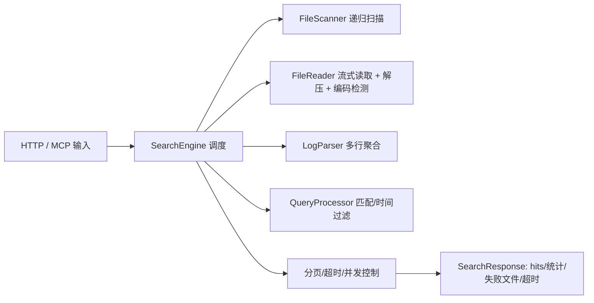

# log-search-mcp

> Rust 实现的日志搜索 MCP 工具，支持多行日志解析、逻辑/时间过滤、并发扫描，并同时提供 HTTP 与 MCP(stdio) 接口。


## 核心特性

- **MCP 标准支持**：完美适配 Trae, Claude Desktop 等 AI Agent，提供 `list_log_files` 和 `search_logs` 工具。
- **配置热更新**：修改配置文件后自动重载，无需重启服务。
- **灵活的日志源**：支持通过 `log_file_paths` 指定具体文件，或通过目录扫描（Glob patterns）。
- **多行解析**：可配置 `line_start_regex` 聚合多行日志（如 Java 堆栈跟踪）。
- **只读流式读取**：自动编码检测（含 UTF-16 BOM）、Gzip 自动解压，高效处理大文件。
- **强大的搜索**：逻辑组合（AND/OR/NOT）、正则匹配、时间范围过滤。

## 快速开始

### 1. 编译项目

```bash
cargo build --release
# 二进制文件位于 target/release/log-search-mcp
```

### 2. 配置文件 (`config.yaml`)

创建一个配置文件（如 `mcp_config.yaml`）：

```yaml
server:
  mode: stdio        # MCP 必须使用 stdio 模式

log_parser:
  # 用于识别多行日志的起始行正则（例如以日期开头）
  line_start_regex: '^\d{4}-\d{2}-\d{2}' 
  # 提取时间戳的正则，用于按时间范围搜索
  default_timestamp_regex: '\d{4}-\d{2}-\d{2}[T ]\d{2}:\d{2}:\d{2}'

search:
  default_page_size: 20
  max_page_size: 200
  default_timeout_ms: 5000
  max_concurrent_files: 4
  buffer_size: 65536

log_sources:
  # 可选：指定具体的日志文件路径列表
  # 如果配置了此项，工具将优先搜索这些文件
  log_file_paths:
    - "/var/log/system.log"
    - "/path/to/app.log"
```

### 3. 集成到 Agent (如 Trae)

在 Trae 的 MCP 服务器配置中添加以下内容：

```json
{
  "mcpServers": {
    "log-search": {
      "command": "/absolute/path/to/log-search-mcp",
      "args": [
        "/absolute/path/to/mcp_config.yaml"
      ],
      "env": {}
    }
  }
}
```

> **注意**：请务必使用绝对路径。

## 服务器部署 (Docker)

本指南介绍如何将服务部署到远程服务器（如 Linux），并通过 Docker 运行，同时支持本地 MCP 客户端远程连接。

### 1. 准备部署包

在项目根目录下执行打包命令（排除编译产物）：

```bash
tar -czf deploy.tar.gz --exclude='target' --exclude='.git' .
```

### 2. 上传并构建

将压缩包上传到服务器（例如 `/home/log-mcp-rs`），然后执行以下操作：

```bash
# 解压
mkdir -p /home/log-mcp-rs
tar -xzf deploy.tar.gz -C /home/log-mcp-rs
cd /home/log-mcp-rs

# 构建 Docker 镜像
# 注意：Dockerfile 已针对国内网络优化（使用阿里云源）
docker build -t log-mcp-rs:latest .
```

### 3. 启动服务

使用 Docker 运行服务，挂载宿主机日志目录：

```bash
docker run -d \
  --name log-mcp-rs \
  --restart unless-stopped \
  -p 3000:3000 \
  -v /var/log:/var/log \
  -v /home:/home \
  log-mcp-rs:latest
```

*   `-p 3000:3000`: 暴露 HTTP API 端口（可选，MCP 主要通过 Stdio 通信）。
*   `-v /var/log:/var/log`: 允许容器访问宿主机的日志目录（根据实际需求调整）。

### 4. 远程集成到本地 Agent

您无需在本地运行任何服务，只需通过 SSH 隧道调用远程容器内的进程。

在本地 Agent（如 Trae/Claude Desktop）的配置文件中添加：

```json
{
  "mcpServers": {
    "remote-log-server": {
      "command": "ssh",
      "args": [
        "-o", "StrictHostKeyChecking=no",
        "root@<SERVER_IP>",           // 替换为您的服务器 IP
        "docker", "exec", "-i",       // 在容器内执行
        "-e", "LOG_SEARCH_MCP__SERVER__MODE=stdio", // 强制使用 stdio 模式
        "log-mcp-rs",                 // 容器名称
        "log-search-mcp", "/app/config.yaml"
      ],
      "env": {}
    }
  }
}
```

**前置条件**：本地机器需配置好 SSH 免密登录（SSH Key）到远程服务器，否则 MCP 客户端无法处理密码输入。

## 功能详解

### 配置热更新 (Hot Reload)
服务启动后会监控配置文件的修改。一旦检测到文件变更（例如修改了 `log_file_paths` 或调整了正则），服务会自动重新加载最新配置，无需重启 MCP 连接。

### 日志源配置
您可以通过两种方式指定日志源：
1. **指定文件列表**：在配置文件中设置 `log_sources.log_file_paths`。
2. **目录扫描**：在调用工具时传入 `root_path` 和 Glob 模式（如 `**/*.log`）。

### 多行日志处理
配置 `line_start_regex` 后，解析器会将不匹配该正则的行追加到上一行匹配的日志中。这对于处理异常堆栈非常有用。

### 接口说明
- **MCP (Stdio)**:
  - `list_log_files`: 列出可用日志文件。
  - `search_logs`: 执行搜索，支持逻辑查询和时间过滤。
- **HTTP**:
  - `GET /files`
  - `POST /search`

## 开发与构建

```bash
# 运行测试
cargo test

# 运行 HTTP 模式进行调试
cargo run --release -- ./config.yaml
```

## 架构


