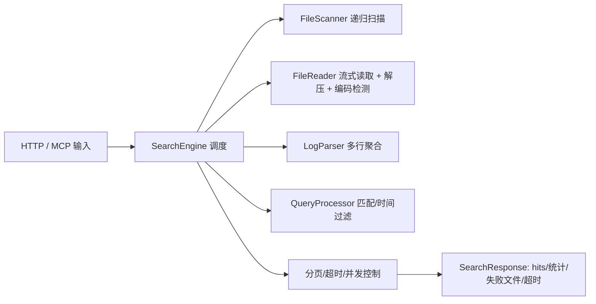

# log-search-mcp

> Rust 实现的日志搜索 MCP 工具，支持多行日志解析、逻辑/时间过滤、并发扫描，并同时提供 HTTP 与 MCP(stdio) 接口。


## 主要功能

- **文件扫描**：递归扫描根目录，默认 include `**/*.log`、`**/*.log.gz`、`**/*.gz`，支持 include/exclude globs，兼容 Windows 路径分隔符。
- **只读流式读取**：自动编码检测（含 UTF-16 BOM）、gzip 解压，按行流式处理大文件，超过 10GB 记录警告。
- **多行解析**：可配置 `log_start_pattern` 聚合多行日志，未配置则单行模式，行号追踪 `start_line`/`end_line`。
- **搜索能力**：文本/正则匹配，大小写/全词选项；must/any/none 逻辑组合；时间过滤（`timestamp_regex` + 时间范围）。
- **性能与控制**：分页 page/page_size，max_hits 早停，hard_timeout_ms 超时返回部分结果；并发文件处理 `max_concurrent_files`。
- **结果信息**：返回命中文件路径、行号区间、可选内容、匹配位置 offset/length、执行时间、扫描数、失败文件、超时标识。
- **接口**：
  - HTTP：`GET /files` 列文件，`POST /search` 执行搜索，JSON 请求/响应，参数错误 400。
  - MCP(stdio)：`list_tools`/`list_log_files`/`search_logs` JSON-RPC 方法，返回结构化 JSON。
- **配置**：YAML/JSON 加载，环境变量覆盖（前缀 `LOG_SEARCH_MCP__...`），校验端口、分页、缓冲区等合法性。

## 实现方案

### 架构总览



### 核心模块与路径

- `src/scanner.rs`：递归扫描，默认 include globs，支持 exclude；路径归一化适配 Windows；空 include 时使用默认集合。
- `src/reader.rs`：只读流式读取，自动编码检测（BOM 优先），UTF-16 全文一次性解码；gzip 通过 tokio 流式解压。
- `src/parser.rs`：多行解析，依据 `log_start_pattern` 聚合；未提供则单行；行号跟踪。
- `src/query.rs`：文本/正则匹配、whole_word、case_sensitive；must/any/none 逻辑；时间过滤（正则提取 + 区间判断）；匹配位置 offset/length。
- `src/search.rs`：并发搜索（max_concurrent_files），分页、max_hits、hard_timeout；超大文件 warn；失败文件收集；支持配置回落的默认 `log_start_pattern`、`timestamp_regex`。
- `src/http.rs`：Axum 路由 `/files`、`/search`，参数错误返回 400，端到端测试覆盖。
- `src/mcp.rs`：MCP stdio JSON-RPC，提供 `list_tools`、`list_log_files`、`search_logs`，返回结构化 JSON/错误码。
- `src/config.rs`：配置结构/加载/校验，YAML/JSON + 环境变量覆盖，校验分页、端口、缓冲区。
- `src/main.rs`：启动入口，支持 HTTP / Stdio / Both 模式，初始化 tracing 日志（`RUST_LOG` 控制）。
- `example.log`：示例多行日志文件，用于解析/搜索测试。

### 数据与请求响应

- 搜索请求体（HTTP `/search` 或 MCP `search_logs` 简版）：

```json
{
  "scan_config": {
    "root_path": "/var/logs/app",
    "include_globs": ["**/*.log"],
    "exclude_globs": ["**/tmp/**"]
  },
  "logical_query": {
    "must": [{ "query": "ERROR", "regex": false, "case_sensitive": false, "whole_word": false }],
    "any": [],
    "none": []
  },
  "time_filter": {
    "time_start": null,
    "time_end": null,
    "timestamp_regex": "\\d{4}-\\d{2}-\\d{2}T\\d{2}:\\d{2}:\\d{2}Z"
  },
  "log_start_pattern": "^\\d{4}-\\d{2}-\\d{2}",
  "page_size": 20,
  "page": 1,
  "max_hits": 200,
  "hard_timeout_ms": 3000,
  "include_content": true
}
```

- 响应关键字段：`total_hits`、`page`、`page_size`、`total_pages`、`hits`（含 `file_path`、`start_line`、`end_line`、`content`、`match_positions`）、`execution_time_ms`、`files_scanned`、`timed_out`、`failed_files`。

- MCP 工具描述（通过 `list_tools` 返回）：
  - `list_log_files`: params `{root_path, include_globs?, exclude_globs?}`
  - `search_logs`: params 同上示例，必需 `scan_config`、`logical_query`，其余可选。

### 默认值与配置覆盖

- 配置示例字段：
  - `server.mode` (http/stdio/both)，`http_addr`，`http_port`
  - `log_parser.default_log_start_pattern`，`log_parser.default_timestamp_regex`
  - `search.default_page_size`，`max_page_size`，`default_timeout_ms`，`max_concurrent_files`，`buffer_size`
- 环境变量覆盖：`LOG_SEARCH_MCP__SERVER__MODE=http`、`LOG_SEARCH_MCP__SEARCH__BUFFER_SIZE=65536` 等。

### 运行方式

```bash
# 1) 运行测试
cargo test

# 2) 启动 HTTP 服务
cargo run --release -- ./config.yaml
# HTTP 端点: /files, /search

# 3) 启动 Stdio/MCP
LOG_SEARCH_MCP__SERVER__MODE=stdio cargo run --release -- ./config.yaml
# 通过 stdin/stdout JSON-RPC 交互
```

### 注意事项

- 确保 `root_path` 存在且为目录；分页 `page >= 1`。
- 超大文件（>10GB）仅记录 warn，不会中断搜索。
- `include_content=false` 时内容为空字符串，但仍提供匹配位置信息。
- 并发文件处理由 `max_concurrent_files` 控制，可按环境调优。

### 路线与可选增强

- 丰富 MCP schema/错误码，完善 CLI 参数校验与帮助信息。
- 增加日志级别/格式配置、资源使用监控、性能基准与压测脚本。
- 支持更多编码/压缩格式，或增量索引/缓存以提升重复查询性能。
