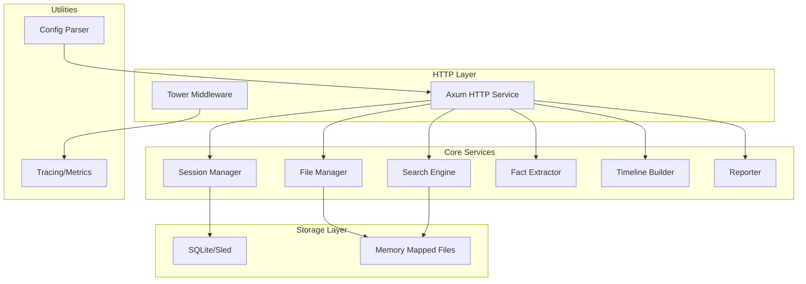

# Design Document

## Overview

log-mcp-rs 是一个高性能的 Rust 日志分析服务，采用零拷贝、并行扫描和智能索引技术实现秒级日志检索和分析。系统通过 HTTP RESTful API 为 LLM Agent 提供会话管理、日志搜索、事实抽取、时间线生成和报告输出等功能。

核心设计原则：
- **零拷贝 I/O**：使用 mmap 直接映射文件到内存，避免数据复制
- **并行处理**：利用 rayon 并行扫描多文件和大文件分块
- **智能短路**：命中数达到限制时立即停止，防止资源浪费
- **时间窗优化**：通过稀疏时间戳索引快速定位目标时间段
- **多模式匹配**：Aho-Corasick 多关键词 + DFA 正则引擎组合

## Architecture

### System Architecture



### Module Responsibilities

1. **axum_service**: HTTP 路由、请求验证、响应序列化
2. **session_store**: 会话生命周期管理、状态持久化
3. **file_manager**: 文件扫描、mmap 映射、编码检测、解压
4. **search_engine**: 时间窗过滤、多关键词匹配、正则匹配
5. **fact_extractor**: 规则模板加载、字段提取
6. **timeline_builder**: 跨文件事件合并、时间排序
7. **reporter**: Markdown/JSON 格式化输出
8. **config**: TOML 配置解析、CLI 参数处理

## Components and Interfaces

### 1. HTTP Service (axum_service)

**职责**：提供 RESTful API 接口，处理 HTTP 请求和响应

**关键接口**：

```rust
// POST /tools/start_session
pub async fn start_session(
    State(app): State<AppState>,
    Json(req): Json<StartSessionRequest>,
) -> Result<Json<StartSessionResponse>, ApiError>

// POST /tools/add_directory
pub async fn add_directory(
    State(app): State<AppState>,
    Json(req): Json<AddDirectoryRequest>,
) -> Result<Json<AddDirectoryResponse>, ApiError>

// POST /tools/inspect_formats
pub async fn inspect_formats(
    State(app): State<AppState>,
    Json(req): Json<InspectFormatsRequest>,
) -> Result<Json<InspectFormatsResponse>, ApiError>

// POST /tools/search
pub async fn search(
    State(app): State<AppState>,
    Json(req): Json<SearchRequest>,
) -> Result<Json<SearchResponse>, ApiError>

// POST /tools/extract_facts
pub async fn extract_facts(
    State(app): State<AppState>,
    Json(req): Json<ExtractFactsRequest>,
) -> Result<Json<ExtractFactsResponse>, ApiError>

// POST /tools/remember
pub async fn remember(
    State(app): State<AppState>,
    Json(req): Json<RememberRequest>,
) -> Result<Json<SuccessResponse>, ApiError>

// POST /tools/timeline
pub async fn timeline(
    State(app): State<AppState>,
    Json(req): Json<TimelineRequest>,
) -> Result<Json<TimelineResponse>, ApiError>

// POST /tools/report
pub async fn report(
    State(app): State<AppState>,
    Json(req): Json<ReportRequest>,
) -> Result<Json<ReportResponse>, ApiError>

// GET /health
pub async fn health() -> Json<HealthResponse>
```

**中间件**：
- Timeout middleware（请求超时）
- Tracing middleware（请求日志）
- CORS middleware（跨域支持）

### 2. Session Manager (session_store)

**职责**：管理用户会话，持久化会话状态

**核心结构**：

```rust
pub struct SessionManager {
    db: Arc<Database>, // SQLite or Sled
}

pub struct Session {
    pub id: String,
    pub created_at: i64,
    pub timezone: String,
    pub files: Vec<FileInfo>,
    pub search_history: Vec<SearchRecord>,
    pub memories: HashMap<String, String>,
}

impl SessionManager {
    pub fn create_session(&self, hint: Option<String>, tz: String) -> Result<String>;
    pub fn get_session(&self, id: &str) -> Result<Session>;
    pub fn add_files(&self, session_id: &str, files: Vec<FileInfo>) -> Result<()>;
    pub fn add_search_record(&self, session_id: &str, record: SearchRecord) -> Result<()>;
    pub fn set_memory(&self, session_id: &str, key: String, value: String) -> Result<()>;
    pub fn remove_memory(&self, session_id: &str, key: &str) -> Result<()>;
}
```

**存储选择**：
- **SQLite**：适合复杂查询和关系数据
- **Sled**：嵌入式 KV 存储，性能更高

### 3. File Manager (file_manager)

**职责**：扫描目录、映射文件、识别编码和格式

**核心结构**：

```rust
pub struct FileManager {
    config: Arc<Config>,
}

pub struct FileInfo {
    pub path: PathBuf,
    pub size: u64,
    pub encoding: Encoding,
    pub timestamp_format: Option<String>,
    pub compression: CompressionType,
}

pub enum CompressionType {
    None,
    Gzip,
}

pub enum Encoding {
    Utf8,
    Gbk,
    Unknown,
}

impl FileManager {
    pub fn scan_directory(&self, dir: &Path, globs: &[String]) -> Result<Vec<FileInfo>>;
    pub fn inspect_file(&self, path: &Path) -> Result<FileInfo>;
    pub fn map_file(&self, path: &Path) -> Result<MappedFile>;
}

pub struct MappedFile {
    mmap: Mmap,
    encoding: Encoding,
    compression: CompressionType,
}

impl MappedFile {
    pub fn as_bytes(&self) -> &[u8];
    pub fn decompress(&self) -> Result<Vec<u8>>;
}
```

**编码检测**：
- 使用 `chardetng` 检测编码
- 支持 UTF-8、GBK、GB18030 等常见编码
- 使用 `encoding_rs` 进行转码

**压缩处理**：
- 使用 `flate2` 或 `zune-inflate` 解压 .gz 文件
- 流式解压避免内存溢出

### 4. Search Engine (search_engine)

**职责**：执行高性能日志搜索

**核心结构**：

```rust
pub struct SearchEngine {
    config: Arc<Config>,
}

pub struct SearchQuery {
    pub time_start: Option<i64>,
    pub time_end: Option<i64>,
    pub must: Vec<String>,
    pub any: Vec<String>,
    pub none: Vec<String>,
    pub regex: Option<String>,
    pub max_hits: usize,
    pub context_lines: usize,
}

pub struct SearchHit {
    pub id: String,
    pub file: String,
    pub family_id: Option<String>,
    pub line_number: usize,
    pub byte_offset: u64,
    pub timestamp: Option<String>, // RFC3339 UTC
    pub content: String,
    pub context_before: Vec<String>,
    pub context_after: Vec<String>,
    pub truncated: bool,
}

pub struct SearchResult {
    pub hits: Vec<SearchHit>,
    pub truncated: bool,
    pub cursor: Option<String>, // base64url encoded
    pub stats: SearchStats,
}

pub struct SearchStats {
    pub files_scanned: usize,
    pub bytes_scanned: u64,
    pub compute_ms: u64,
    pub io_mode_used: String,
    pub regex_cache_hits: usize,
    pub ac_dict_size: usize,
    pub candidate_lines: usize,
    pub skipped_none_hits: usize,
    pub regex_timeouts: usize,
    pub truncated_lines: usize,
}

pub struct SearchCursor {
    pub session_id: String,
    pub file: String,
    pub byte_off: u64,
    pub ts_floor: String,
    pub pattern_cache_id: String,
    pub page_size: usize,
    pub issued_at: i64,
}

impl SearchEngine {
    pub fn search(&self, files: &[FileInfo], query: &SearchQuery) -> Result<SearchResult>;
}
```

**搜索流程**：


**优化技术**：

1. **时间窗索引**：
   - 每 1000 行采样一个时间戳
   - 二分查找定位起止偏移
   - 仅扫描目标时间段

2. **Aho-Corasick 多关键词**：
   - 构建自动机一次扫描所有关键词
   - 命中 `none` 关键词立即丢弃该行
   - 减少正则引擎负载

3. **并行扫描**：
   - 使用 `rayon` 并行处理多文件
   - 大文件分块并行扫描
   - 命中数达到 `max_hits` 时短路

4. **正则引擎**：
   - 使用 `regex-automata` 编译为 DFA
   - 设置超时防止 ReDoS 攻击
   - 仅对候选行执行正则匹配

### 5. Fact Extractor (fact_extractor)

**职责**：从日志中提取结构化信息

**核心结构**：

```rust
pub struct FactExtractor {
    rules: Vec<ExtractionRule>,
}

pub struct ExtractionRule {
    pub name: String,
    pub pattern: Regex,
    pub fields: Vec<String>,
}

pub struct Fact {
    pub rule_name: String,
    pub fields: HashMap<String, String>,
    pub source_hit_id: String,
}

impl FactExtractor {
    pub fn load_rules(rules_dir: &Path) -> Result<Self>;
    pub fn extract(&self, hits: &[SearchHit]) -> Result<Vec<Fact>>;
}
```

**规则模板示例**（facts.d/battery.toml）：

```toml
[[rule]]
name = "battery_level"
pattern = "battery.*?(\\d+)%"
fields = ["percentage"]

[[rule]]
name = "collision_event"
pattern = "collision detected.*?object_id=(\\w+)"
fields = ["object_id"]
```

### 6. Timeline Builder (timeline_builder)

**职责**：合并跨文件事件，生成时间线

**核心结构**：

```rust
pub struct TimelineBuilder;

pub struct TimelineEvent {
    pub timestamp: i64,
    pub file: String,
    pub line_number: usize,
    pub content: String,
    pub facts: Vec<Fact>,
}

impl TimelineBuilder {
    pub fn build(session: &Session) -> Result<Vec<TimelineEvent>>;
}
```

**构建流程**：
1. 收集 Session 中所有搜索结果
2. 解析每行的时间戳
3. 按时间戳升序排序
4. 关联已抽取的事实

### 7. Reporter (reporter)

**职责**：生成诊断报告

**核心结构**：

```rust
pub struct Reporter;

pub struct ReportRequest {
    pub session_id: String,
    pub format: ReportFormat,
    pub include_snippets: bool,
    pub lang: String,
}

pub enum ReportFormat {
    Markdown,
    Json,
}

pub struct Report {
    pub summary: String,
    pub timeline: Vec<TimelineEvent>,
    pub facts: Vec<Fact>,
    pub memories: HashMap<String, String>,
    pub snippets: Option<Vec<String>>,
}

impl Reporter {
    pub fn generate(session: &Session, req: &ReportRequest) -> Result<String>;
}
```

**Markdown 模板**：

```markdown
# 日志诊断报告

## 概要
- 会话 ID: {session_id}
- 分析时间: {timestamp}
- 文件数: {file_count}
- 事件数: {event_count}

## 时间线
| 时间 | 文件 | 内容 |
|------|------|------|
| ... | ... | ... |

## 关键事实
- battery_level: 45%
- collision_event: object_id=ABC123

## 已知结论
- 电池电量低于 50% 时发生碰撞
- 任务 ID: TASK-456

## 日志片段
```
[snippet content]
```
```

## Data Models

### Configuration Model

```rust
#[derive(Deserialize)]
pub struct Config {
    pub server: ServerConfig,
    pub fs: FsConfig,
    pub limits: LimitsConfig,
    pub search: SearchConfig,
    pub sessions: SessionsConfig,
    pub auth: AuthConfig,
    pub security: SecurityConfig,
    pub clock_drift_policy: ClockDriftConfig,
}

#[derive(Deserialize)]
pub struct ServerConfig {
    pub bind: String,
    pub api_version: String, // "v1"
    pub graceful_shutdown_timeout: u64, // seconds
}

#[derive(Deserialize)]
pub struct FsConfig {
    pub allow_roots: Vec<PathBuf>,
    pub deny_patterns: Vec<String>,
    pub io_mode: IoMode, // mmap | buffered | auto
}

#[derive(Deserialize)]
pub enum IoMode {
    Mmap,
    Buffered,
    Auto,
}

#[derive(Deserialize)]
pub struct LimitsConfig {
    pub max_upload_mb: usize,
    pub max_hits: usize, // default: 500
    pub regex_timeout_ms: u64, // default: 50
    pub max_context_lines: usize, // default: 12
    pub max_line_bytes: usize, // default: 1_048_576 (1MB)
    pub content_length_limit_mb: usize, // default: 10
}

#[derive(Deserialize)]
pub struct SearchConfig {
    pub enable_temp_index: bool,
    pub temp_index_threshold_mb: usize,
    pub sparse_index_stride_lines: usize, // default: 1000
    pub page_size: usize, // default: 100
    pub max_scanned_bytes: u64, // default: 2_000_000_000 (2GB)
}

#[derive(Deserialize)]
pub struct SessionsConfig {
    pub session_ttl: String, // default: "7d"
    pub max_session_bytes: String, // default: "5GB"
}

#[derive(Deserialize)]
pub struct AuthConfig {
    pub api_keys: Vec<String>,
    pub ip_whitelist: Vec<String>,
    pub rate_limit: RateLimitConfig,
}

#[derive(Deserialize)]
pub struct RateLimitConfig {
    pub qps_per_key: u32, // default: 10
}

#[derive(Deserialize)]
pub struct SecurityConfig {
    pub cursor_ttl: u64, // seconds, default: 600
    pub enable_cors: bool, // default: false
    pub cors_origins: Vec<String>, // explicit origins only
}

#[derive(Deserialize)]
pub struct ClockDriftConfig {
    pub seconds: i64, // default: 3
}
```

### Database Schema (SQLite)

```sql
CREATE TABLE sessions (
    id TEXT PRIMARY KEY,
    created_at INTEGER NOT NULL,
    timezone TEXT NOT NULL,
    hint TEXT
);

CREATE TABLE session_files (
    session_id TEXT NOT NULL,
    path TEXT NOT NULL,
    size INTEGER NOT NULL,
    encoding TEXT NOT NULL,
    timestamp_format TEXT,
    compression TEXT NOT NULL,
    FOREIGN KEY (session_id) REFERENCES sessions(id)
);

CREATE TABLE search_records (
    id TEXT PRIMARY KEY,
    session_id TEXT NOT NULL,
    query_json TEXT NOT NULL,
    result_count INTEGER NOT NULL,
    duration_ms INTEGER NOT NULL,
    created_at INTEGER NOT NULL,
    FOREIGN KEY (session_id) REFERENCES sessions(id)
);

CREATE TABLE search_hits (
    id TEXT PRIMARY KEY,
    record_id TEXT NOT NULL,
    file TEXT NOT NULL,
    line_number INTEGER NOT NULL,
    timestamp INTEGER,
    content TEXT NOT NULL,
    FOREIGN KEY (record_id) REFERENCES search_records(id)
);

CREATE TABLE memories (
    session_id TEXT NOT NULL,
    key TEXT NOT NULL,
    value TEXT NOT NULL,
    PRIMARY KEY (session_id, key),
    FOREIGN KEY (session_id) REFERENCES sessions(id)
);

CREATE TABLE facts (
    id TEXT PRIMARY KEY,
    session_id TEXT NOT NULL,
    hit_id TEXT NOT NULL,
    rule_name TEXT NOT NULL,
    fields_json TEXT NOT NULL,
    FOREIGN KEY (session_id) REFERENCES sessions(id),
    FOREIGN KEY (hit_id) REFERENCES search_hits(id)
);
```

## Error Handling

### Error Types

```rust
#[derive(Debug, thiserror::Error)]
pub enum LogMcpError {
    #[error("Session not found: {0}")]
    SessionNotFound(String), // 404, retry: false
    
    #[error("File access denied: {0}")]
    FileAccessDenied(PathBuf), // 403, retry: false
    
    #[error("Invalid encoding: {0}")]
    InvalidEncoding(String), // 400, retry: false
    
    #[error("Bad time range: {0}")]
    BadTimeRange(String), // 400, retry: false
    
    #[error("Search timeout")]
    SearchTimeout, // 408, retry: true
    
    #[error("Regex timeout")]
    RegexTimeout, // 408, retry: true
    
    #[error("Regex compilation failed: {0}")]
    RegexError(String), // 400, retry: false
    
    #[error("Too many hits")]
    TooManyHits, // 206, retry: true
    
    #[error("Quota exceeded")]
    QuotaExceeded, // 429, retry: true
    
    #[error("Cursor expired")]
    CursorExpired, // 400, retry: true (need new search)
    
    #[error("Rate limited")]
    RateLimited { retry_after_ms: u64 }, // 429, retry: true
    
    #[error("Database error: {0}")]
    DatabaseError(String), // 500, retry: true
    
    #[error("IO error: {0}")]
    IoError(#[from] std::io::Error), // 500, retry: true
    
    #[error("Configuration error: {0}")]
    ConfigError(String), // 500, retry: false
    
    #[error("Internal error: {0}")]
    Internal(String), // 500, retry: true
}

pub type Result<T> = std::result::Result<T, LogMcpError>;

impl LogMcpError {
    pub fn error_code(&self) -> &'static str {
        match self {
            Self::SessionNotFound(_) => "SESSION_NOT_FOUND",
            Self::FileAccessDenied(_) => "FILE_DENIED",
            Self::InvalidEncoding(_) => "INVALID_ENCODING",
            Self::BadTimeRange(_) => "BAD_TIME_RANGE",
            Self::SearchTimeout => "SEARCH_TIMEOUT",
            Self::RegexTimeout => "REGEX_TIMEOUT",
            Self::RegexError(_) => "REGEX_ERROR",
            Self::TooManyHits => "TOO_MANY_HITS",
            Self::QuotaExceeded => "QUOTA_EXCEEDED",
            Self::CursorExpired => "CURSOR_EXPIRED",
            Self::RateLimited { .. } => "RATE_LIMITED",
            Self::DatabaseError(_) => "DATABASE_ERROR",
            Self::IoError(_) => "IO_ERROR",
            Self::ConfigError(_) => "CONFIG_ERROR",
            Self::Internal(_) => "INTERNAL",
        }
    }
    
    pub fn is_retryable(&self) -> bool {
        matches!(
            self,
            Self::SearchTimeout
                | Self::RegexTimeout
                | Self::TooManyHits
                | Self::QuotaExceeded
                | Self::CursorExpired
                | Self::RateLimited { .. }
                | Self::DatabaseError(_)
                | Self::IoError(_)
                | Self::Internal(_)
        )
    }
}
```

### HTTP Error Responses

```rust
impl IntoResponse for LogMcpError {
    fn into_response(self) -> Response {
        let status = match self {
            Self::SessionNotFound(_) => StatusCode::NOT_FOUND,
            Self::FileAccessDenied(_) => StatusCode::FORBIDDEN,
            Self::InvalidEncoding(_) | Self::BadTimeRange(_) | Self::RegexError(_) | Self::CursorExpired => {
                StatusCode::BAD_REQUEST
            }
            Self::SearchTimeout | Self::RegexTimeout => StatusCode::REQUEST_TIMEOUT,
            Self::TooManyHits => StatusCode::PARTIAL_CONTENT,
            Self::QuotaExceeded | Self::RateLimited { .. } => StatusCode::TOO_MANY_REQUESTS,
            _ => StatusCode::INTERNAL_SERVER_ERROR,
        };
        
        let mut json = json!({
            "error": self.to_string(),
            "code": self.error_code(),
            "retryable": self.is_retryable(),
        });
        
        if let Self::RateLimited { retry_after_ms } = self {
            json["retry_after_ms"] = json!(retry_after_ms);
        }
        
        (status, Json(json)).into_response()
    }
}
```

### Retry Strategy

- **文件 I/O 错误**：重试 3 次，指数退避
- **数据库锁冲突**：重试 5 次，指数退避（≤ 100ms × 5 次），启用 WAL 模式
- **正则超时**：不重试，返回部分结果
- **游标过期**：客户端需重新发起首次搜索

### Database Configuration

```sql
-- Enable WAL mode for better concurrency
PRAGMA journal_mode=WAL;
PRAGMA synchronous=NORMAL;
PRAGMA busy_timeout=5000;
```

## Testing Strategy

### Unit Tests

- **session_store**: 会话 CRUD 操作、并发访问
- **file_manager**: 编码检测、压缩解压、glob 匹配
- **search_engine**: 时间窗过滤、关键词匹配、正则匹配
- **fact_extractor**: 规则加载、字段提取
- **timeline_builder**: 事件排序、时间戳解析
- **reporter**: Markdown/JSON 格式化

### Integration Tests

- **端到端流程**：创建会话 → 挂载目录 → 搜索 → 抽取 → 报告
- **并发会话**：20 个并发会话同时搜索
- **大文件处理**：1GB 文件搜索性能
- **压缩文件**：.gz 文件解压和搜索

### Performance Tests

- **300MB 文件关键词搜索**：P50 < 1s, P95 < 2s
- **1GB 文件关键词+正则**：首次 < 5s, 重复 < 1s
- **事实抽取（200 命中）**：< 500ms
- **并发吞吐**：20 并发会话无性能降级

### Test Data

- 生成模拟日志文件（不同大小、编码、格式）
- 包含已知时间戳、关键词和事实的测试数据
- 压缩和非压缩版本

## Performance Optimizations

### Memory Management

- 使用 `mimalloc` 或 `jemalloc` 替换系统分配器
- mmap 文件避免加载到堆内存
- 搜索结果使用 `Arc<str>` 共享字符串

### CPU Optimization

- `rayon` 并行扫描多文件
- SIMD 加速（Aho-Corasick 自动使用）
- 短路机制减少无效计算

### I/O Optimization

- mmap 零拷贝读取
- 流式解压避免内存峰值
- 异步 I/O（tokio）

### Caching Strategy

- 时间戳索引缓存（Session 级别）
- 编码检测结果缓存
- 正则编译结果缓存

## Deployment Considerations

### Docker Image

- 多阶段构建减小镜像体积
- 使用 distroless 基础镜像
- 静态链接 Rust 二进制

### Resource Limits

- 内存限制：建议 2GB+
- CPU：建议 2 核+
- 磁盘：根据日志文件大小

### Monitoring

- Prometheus metrics 导出
- Tracing 日志输出到 stdout
- 健康检查端点

### Security

- 配置 `allow_roots` 限制文件访问
- 配置 `deny_patterns` 阻止敏感文件
- 正则超时防止 ReDoS
- 文件大小限制防止 OOM
